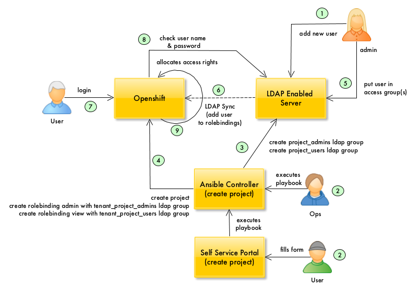
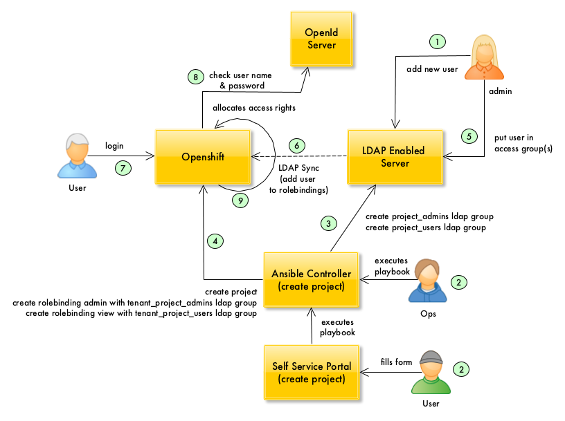
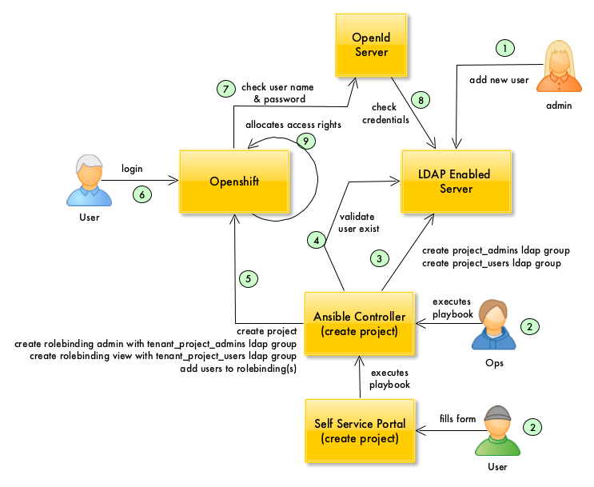

# OCP Identity & Access Management

### Index

- [Authenticating Users](#authenticating-users)
- [Authorising Users](#authorising-users)
- [IDAM Integration Scenarios](#idam-integration)
    - [LDAP Authentication + LDAP Sync](#ldap-sync)
    - [OpenID Authentication + LDAP Sync](#openid-sync)
    - [OpenID Authentication - No LDAP Sync](#openid-nosync)

## Authenticating Users

### LDAP Authentication

In order to authenticate users, OCP can be configured to use the [LDAPPasswordIdentityProvider](https://docs.openshift.com/container-platform/3.9/install_config/configuring_authentication.html#LDAPPasswordIdentityProvider) to validate user names and passwords 
against an LDAPv3 server, using simple bind authentication.

The LDAP directory is queried for an entry that matches the provided user name. 
If a single entry is found, a simple bind is attempted using the distinguished name (DN) of the entry 
plus the provided password.

### OpenID Authentication

In order to authenticate users, OCP can be configured to use the [OpenIDIdentityProvider](https://docs.openshift.com/container-platform/3.9/install_config/configuring_authentication.html#OpenID) using an [authorization code flow](https://openid.net/specs/openid-connect-core-1_0.html#CodeFlowAuth).

## Authorising Users

In order to authorise users in OCP, two LDAP groups per OCP project in the LDAP server, as follows:

| Name | Description |
|:---|:---|
| TenantName_ProjectName_Admins | Users in this group are bound to the **admin** OCP Default Cluster role. |
| TenantName_ProjectName_Users | Users in this group are bound to the **view** OCP Default Cluster role. |

where:

- TenantName: a descriptor associated with the business project, which encompasses one or more OCP projects.
- ProjectName: a descriptor associated with the OCP project purpose.

for example:

| Name | Description |
|:---|:---|
| IceCreamService_Development_Admins | Administrators in the development environment for the ice cream service. |
| IceCreamService_Development_Users | Users in the development environment for the ice cream service. |
| IceCreamService_Test_Users | Administrators in the test environment for the ice cream service. |
| IceCreamService_Test_Users | Users in the test environment for the ice cream service. |

The following default cluster roles have role bindings to the LDAP server:

|  Role | Description |
|:---|:---|
| **admin** | Have rights to view any resource in the project and modify any resource in the project except for quota. |
| **view** | Have rights to view most objects in a project. Cannot view or modify roles or bindings. |

## IDAM integration Scenarios

This section describes the integration points with the Identity and Access Management functions.

### Scenario 1: LDAP Authentication + LDAP Sync

The following image shows the tasks required to set up an OCP project for LDAP based authentication and LDAP sync for access control: 

</img>

1. An organisation managing access via their LDAP servers uses its 
standard on-boarding process to add and remove users from their servers.

2. Either a user fills a form on a self service portal or an ops person executes an Ansible playbook to create one or more OCP projects.

3. The playbook creates two groups per OCP project in the LDAP server. 
The group names follow a specific naming convention. 
One group is for standard project users and the other group is for project admins.

4. The playbook creates the required objects in OCP, namely project(s), and role bindings.
Role binding information is used by the LDAP sync function to add users from the LDAP server to the role bindings in OCP.

5. An organisation admin puts users into the access groups automatically created in the previous step.

6. The LDAP sync function queries the LDAP server for users in access groups and updates the role bindings in OCP.
The sync can be configured to run at specific intervals (e.g. 15 minutes).

7. The user attempts to login into OCP.

8. OCP uses the [LDAPPasswordIdentityProvider](https://docs.openshift.com/container-platform/3.9/install_config/configuring_authentication.html#LDAPPasswordIdentityProvider) to query the LDAP server and check the user name and password provided are correct.

9. OCP allocates access rights to the user based on the information stored in the role bindings.

### Scenario 2: OpenID Authentication + LDAP Sync

The following image shows the tasks required to set up an OCP project for OpenId authentication with LDAP sync for access control: 

</img>

1. An organisation managing access via their LDAP servers uses its 
standard on-boarding process to add and remove users from their servers.

2. Either a user fills a form on a self service portal or an ops person executes an Ansible playbook to create one or more OCP projects.

3. The playbook creates two groups per OCP project in the LDAP server. 
The group names follow a specific naming convention. 
One group is for standard project users and the other group is for project admins.

4. The playbook creates the required objects in OCP, namely project(s), and role bindings.
Role binding information is used by the LDAP sync function to add users from the LDAP server to the role bindings in OCP.

5. An organisation admin puts users into the access groups automatically created in the previous step.

6. The LDAP sync function queries the LDAP server for users in access groups and updates the role bindings in OCP.
The sync can be configured to run at specific intervals (e.g. 15 minutes).

7. The user attempts to login into OCP.

8. OCP uses the [OpenIDIdentityProvider](https://docs.openshift.com/container-platform/3.9/install_config/configuring_authentication.html#OpenID) to query the OpenID server and check the user name and password provided are correct.

9. The OpenID server check credentials, in the LDAP server.

10. OCP allocates access rights to the user based on the information stored in the role bindings.

### Scenario 3: OpenID Authentication - No LDAP Sync

The following image shows the tasks required to set up an OCP project for OpenId authentication with no LDAP sync (users added to rolebindings at project provisioning time): 

</img>

1. An organisation managing access via their LDAP servers uses its 
standard on-boarding process to add and remove users from their servers.

2. Either a user fills a form on a self service portal or an ops person executes an Ansible playbook to create one or more OCP projects.

3. The playbook connects to the LDAP server and verifies that the user(s) exist. If not, they wont't be added to the role bindings later.

4. The playbook creates the required objects in OCP, namely project(s), role bindings, and add users to the role bindings.

5. The user attempts to login into OCP.

6. OCP uses the [OpenIDIdentityProvider](https://docs.openshift.com/container-platform/3.9/install_config/configuring_authentication.html#OpenID) to query the OpenID server and check the user name and password provided are correct.

7. The OpenID server check credentials, in the LDAP server.

8. OCP allocates access rights to the user based on the information stored in the role bindings.

**NOTES** 

- the management of access rights is done purely within OCP, no LDAP server is involved. This means that role bindings in OCP need to be updated (by the automation via the OCP API) as user access requirements to OCP projects change over the lifecycle of an application. 
